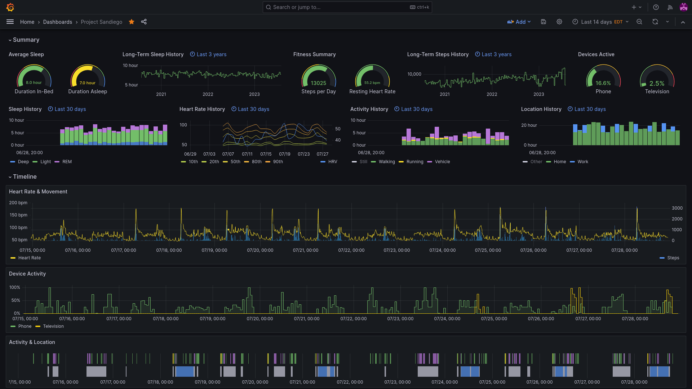

# Sandiego



## Purpose

Sandiego is a project brought about by my frustration at having my data in different places and disliking the native interfaces for those apps. My primary qualm was with the Fitbit app, but the Home Assistant app has had its own issues. As my main two apps, these are the main data providers for this project. Older data has been scraped from Google Takeout and Prometheus. I wanted to have everything visible in one place and auto-updated multiple times per day.

As part of this project I also wanted to be able to correct and insert data as necessary. This is possible with proper time series databases but I am more familiar with Postgres and I am happy entering data manually as required. In order to be able to easily cross-reference events and build correlations, all metrics are collated into a table based on sample rate. I have a daily summary table with a high-level overview and aggregations, and 15-minute and 1-minute tables for more granular data.

Grafana was the easy choice for visualizations. You can see an example of the dashboard I built with that data above. I hope they continue working on X-Y plots and add correlation features in the future.

## Usage

In order to run this yourself you will need the following:

- Python (>=3.11) or Docker
- Postgres (any modern version)

When running this script you will need to provide some environment variables and some files:

### Environment Variables

- `POSTGRES_HOSTNAME`: for connecting to the database, **required**
- `POSTGRES_PORT`: for connecting to the database, defaults to 5432
- `POSTGRES_DB`: for connecting to the database, defaults to `sandiego`
- `POSTGRES_USERNAME`: for connecting to the database, defaults to `sandiego`
- `POSTGRES_PASSWORD`: for connecting to the database, **required**
- `HASS_URL`: for connecting to Home Assistant, required if you are using Home Assistant
- `HASS_API_KEY`: for connecting to Home Assistant, required if you are using Home Assistant
- `SANDIEGO_SLEEP_MINUTES`: the number of minutes to sleep between script runs, defaults to 15 minutes
- `SANDIEGO_LOOKBACK_MINUTES`: the number of minutes to backfill data, defaults to 2880 minutes (2 days)
- `SANDIEGO_BACKFILL_METRIC`: if present, only run the script for that metric (useful for adding a new metric)

### Configuration File

The configuration file should be stored at `./configuration.yaml` and it should have the following structure:

```
providers:
    homeassistant:
        enabled: true
    fitbit:
        enabled: true
```

The `providers` top-level item will contain the list of valid data providers. Most of the provider settings are hard-coded in the script but will be brought into the configuration file eventually. 

- If `enabled` is false, that datasource will be skipped during future runs. This can be helpful when a datasource has low rate limits. If you only need to run for one metric, consider using the `SANDIEGO_BACKFILL_METRIC` environment variable instead.

```
tables:
    daily_summary:
        duration_minutes: 1440
        align_offset_minutes: 480
    intraday_15m:
        duration_minutes: 15
        align_offset_minutes: 0
    intraday_1m:
        duration_minutes: 1
        align_offset_minutes: 0
```

The `tables` item will contain all tables written to by the script. **You will need to generate these tables before running the script.** A sample schema is available in the `schema` folder. 

- `duration_minutes` indicates the "width" of each time bucket in minutes. Note some data types, such as sleep or HRV, are naturally suited for daily aggregation.
- `align_offset_minutes` indicates the offset from midnight the "grid" of time buckets will be built from. Only really useful for aligning the days of the daily buckets.

```
metrics:
    sleep_hours_inbed:
        tables:
            - daily_summary
        provider: fitbit
        fitbit_type: sleep
        aggregate: fitbit_sleep
        fitbit_sleep_item: hours_inbed
    ...
    zone_hours_home:
        tables:
            - daily_summary
        provider: homeassistant
        hass_metric_id: person.justin
        aggregate: hass_state_to_hours
        select_states: 
            - home
    ...
    device_hours_phone:
        tables:
            - daily_summary
            - intraday_15m
        provider: homeassistant
        hass_metric_id: binary_sensor.justin_pixel5_device_locked
        aggregate: hass_state_to_hours
        select_states: 
            - "off" # off = unlocked
    ...
```

The `metrics` item defines all metrics to be downloaded, aggregated, and saved in the database.

- The metric name will also define the column name in the database.
- `tables` is a list of which tables the metric should be stored in. Note the metric will be aggregated (via sum, mean, percentile, etc.) to each table's time bucket.
- `provider` defines which datasource provider shall be used for the metric.
- `fitbit_type`, a field that must be set on fitbit metrics to define what URL schema to use for API connections. Must be defined by the provider's `url_schema`.
- `aggregate` defines the aggregation method to be used for the metric. Will eventually become more generalized, currently must be one of:
    - `fitbit_sleep`
    - `fitbit_steps_sum`
    - `fitbit_heart_mean`
    - `fitbit_heart_percentile`
    - `fitbit_heart_rmssd`
    - `hass_state_to_select`
    - `hass_state_to_hours`

Additional fields, as required by the aggregate function:
- `fitbit_sleep` requires `fitbit_sleep_item`, which must be one of:
    - `hours_inbed`
    - `hours_asleep`
    - `hours_deep`
    - `hours_light`
    - `hours_rem`
    - `hours_wake`
    - `time_start`
    - `time_end`
- `fitbit_heart_percentile` requires `fitbit_heart_percentile`, which must be a number between 0 and 100.
- `hass_state_to_hours` requires `select_states`, which must be a list of states to be defined as "active" for that metric.

### Secrets Files

The Fitbit secrets file should be valid json with the data for your registered app. You can get this information on [this page](https://dev.fitbit.com/build/reference/web-api/troubleshooting-guide/oauth2-tutorial/). The script needs to be able to read and write to this file in order to cycle the access and refresh tokens.

Ensure you include the following items in `secrets/fitbit.json`:

```
{
    "client_id": ...
    "client_secret": ...
    "basic_token": ...
    "access_token": ...
    "refresh_token": ...
}
```

### Running

To run with Docker:

```
git clone git@github.com:wasabipesto/sandiego.git
cd sandiego
docker build -t sandiego .
docker run -d \
    -v ${PWD}/secrets:/usr/src/secrets \
    -v ${PWD}/configuration.yml:/usr/src/configuration.yml:ro \
    -u $(id -u ${USER}):$(id -g ${USER}) \
    --restart unless-stopped \
    --name sandiego \
    --env-file .env \
    sandiego
```

## Roadmap

- [ ] Generalized aggregation functions
- [ ] Indoor climate data
- [ ] Outdoor climate data
- [ ] Nutrition, specifically water intake
